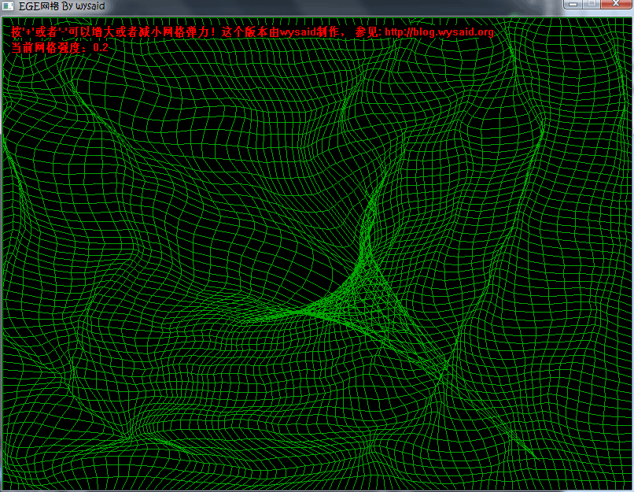

# EGE 网格变形演示程序

一个基于物理模拟的交互式网格变形演示程序。使用鼠标拖拽网格节点，观察弹性网格的变形和恢复效果。

**deps (for ui)：** EGE v25.11+

## 编译构建

使用 CMake 构建项目（已集成 EGE 库）：

```powershell
mkdir build && cd build
cmake ..
cmake --build . --parallel 4
```

或在 VS Code 中按 `Ctrl+Shift+B` 快速构建。

## 交互操作

- **鼠标拖拽**：拖拽网格上的任意位置可拉扯网格
- **`+` 键**：增加网格弹性强度
- **`-` 键**：减小网格弹性强度
- **`ESC` 键**：退出程序



## 物理模拟算法

### 核心思想

程序将网格看作一个由弹簧连接的质点系统。每个网格点受到相邻四个点的弹性拉力，在拉力和阻尼的共同作用下，网格会出现自然的弹性变形和回复效果。

### 数学模型

#### 1. 网格初始化

- 创建 $m \times n$ 的网格点阵
- 每个点 $P_i$ 存储：位置 $(x_i, y_i)$ 和速度 $(v_x, v_y)$
- 归一化坐标空间：$x, y \in [0, 1]$

#### 2. 弹性力计算

对于内部点，计算其四个相邻点的拉力：

$$F_i = k \sum_{j \in neighbors} (P_j - P_i)$$

其中：

- $k$ 是弹性系数（可实时调节）
- $P_j - P_i$ 是点之间的位移向量

相邻点的定义：上下左右四个方向的网格点

#### 3. 数值积分（Verlet 积分）

使用显式欧拉方法更新位置和速度：

$$a_i = \frac{F_i}{m} + g$$

$$v_i^{new} = (v_i^{old} + a_i \cdot dt) \cdot (1 - d)$$

$$x_i^{new} = x_i^{old} + v_i^{new} \cdot dt$$

其中：

- $a_i$ 是加速度
- $dt$ 是时间步长
- $d$ 是阻尼系数（0 到 1 之间）
- $(1 - d)$ 模拟能量逐渐耗散

#### 4. 边界条件

- **边界点固定**：网格边界的点不参与物理模拟
- **用户交互**：鼠标拖拽时，最近的点被固定到鼠标位置

### 代码实现

关键类和函数：

- **`Point` 结构体**：存储单个网格点的数据
  - `x, y`：当前位置
  - `dx, dy`：速度分量

- **`Net` 类**：网格管理
  - `initNet()`：初始化网格
  - `update()`：执行一步物理模拟
  - `draw()`：绘制网格
  - `catchPoint()`：处理鼠标交互

- **物理参数**：
  - `m_intensity`：弹性强度（通过 +/- 键调节）
  - `阻尼系数`：隐含在更新公式中
  - `时间步长`：固定或自适应

### 性能优化

1. **边界点优化**：边界点直接跳过物理计算
2. **距离阈值**：鼠标交互时只计算最近点
3. **缓冲区交替**：使用双缓冲存储当前和上一帧数据

## 学习价值

这个 Demo 展示了：

- **实时物理模拟**的基本原理
- **弹簧系统**的数值求解方法
- **交互式图形应用**的架构设计
- **性能与精度**的权衡

## 参考资源

- EGE 图形库：<https://github.com/x-ege/xege>
- EGE 官方文档：<https://xege.org/>
